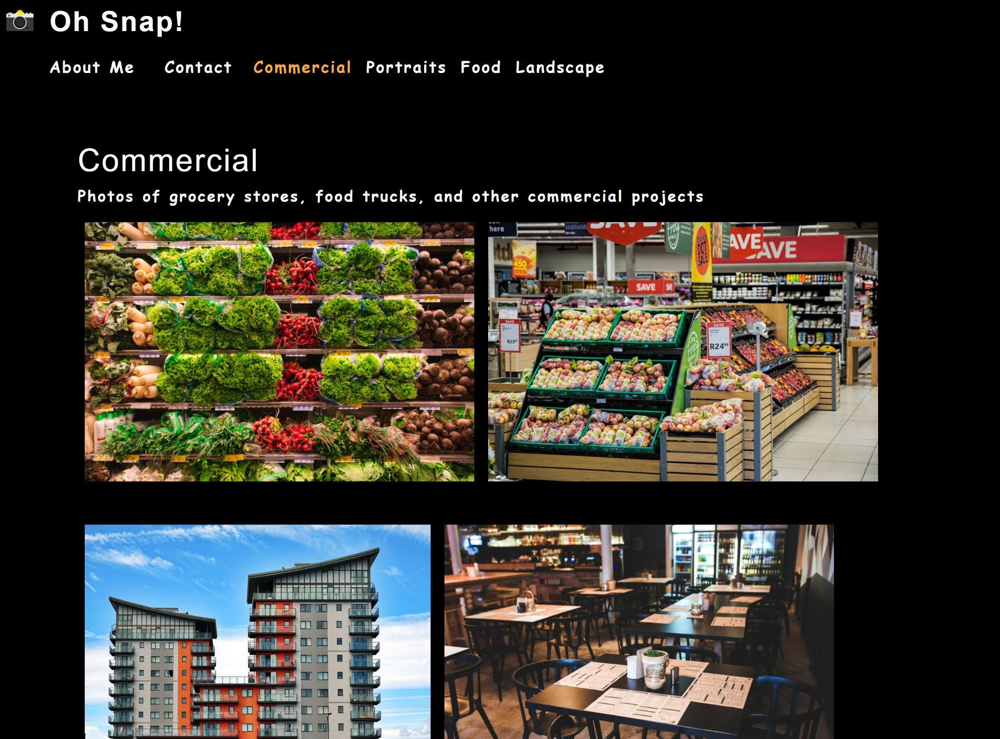

# Photography Portfolio-React

## Description

The purpose of this project was to create a website using React.js. The site has an about me, contact, and different photography gallery sections. The photos displayed and the contact section are conditionally rendered based on the navigationt text selected. Gallery images open in modals. The contact section includes input validation.

## Installation

To install this project, you can clone the repository by using the command prompt

$ git clone https://github.com/AllysonMcGrath/photo-port.git

Detailed instructions for cloning GitHub repositories can be found [here.](https://docs.github.com/en/github/creating-cloning-and-archiving-repositories/cloning-a-repository-from-github/cloning-a-repository)

## Usage

When displaying correctly, the website should look like this:

Use standard git commands within this repository.

Examples:

$ git mv index.html ../
$ git add .
$ git commit -m "commit description"
$ git push origin main

## Credits

Trilogy Education Services, LLC, a 2U, Inc. brand

[Coding Boot Camp at UT](https://github.com/the-Coding-Boot-Camp-at-UT)

## License

MIT License

Copyright (c) 2021 Allyson McGrath

Permission is hereby granted, free of charge, to any person obtaining a copy
of this software and associated documentation files (the "Software"), to deal
in the Software without restriction, including without limitation the rights
to use, copy, modify, merge, publish, distribute, sublicense, and/or sell
copies of the Software, and to permit persons to whom the Software is
furnished to do so, subject to the following conditions:

The above copyright notice and this permission notice shall be included in all
copies or substantial portions of the Software.
